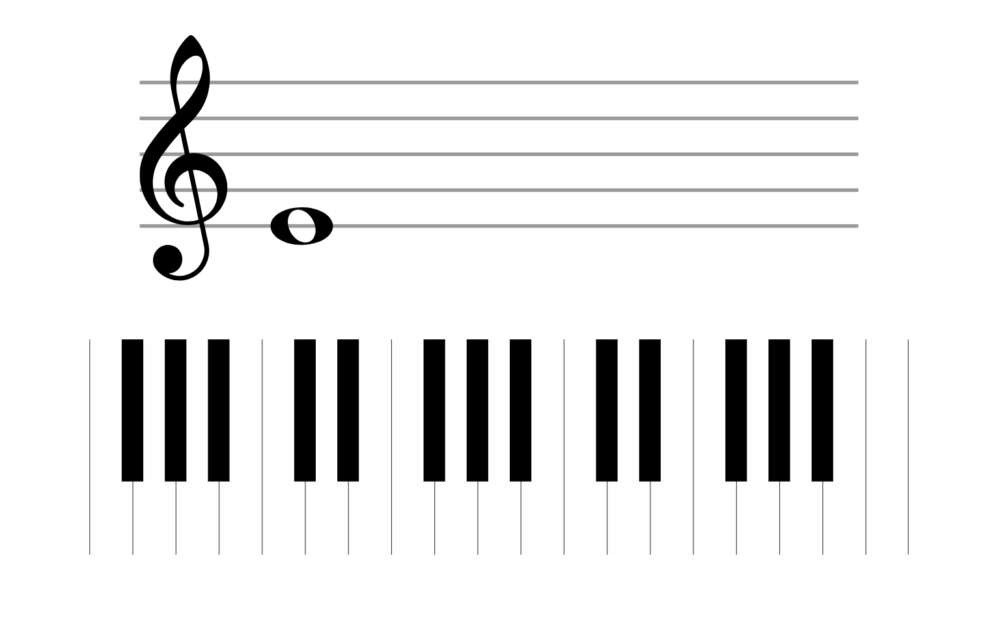

# Piano keyboard

Renders a basic piano keyboard and a staff displaying a note. The user must play the note, and once they do, the cycle repeats. In adddition, this app supports midi input, so use a midi keyboard for a much better experience!

